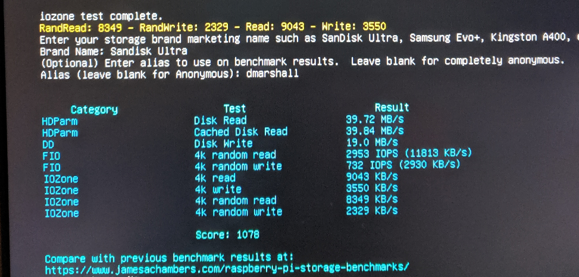
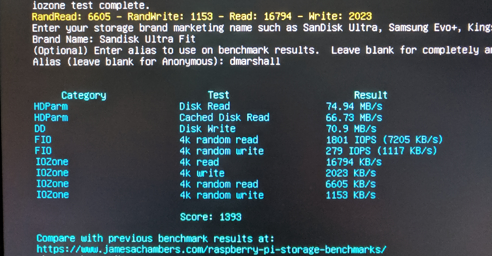
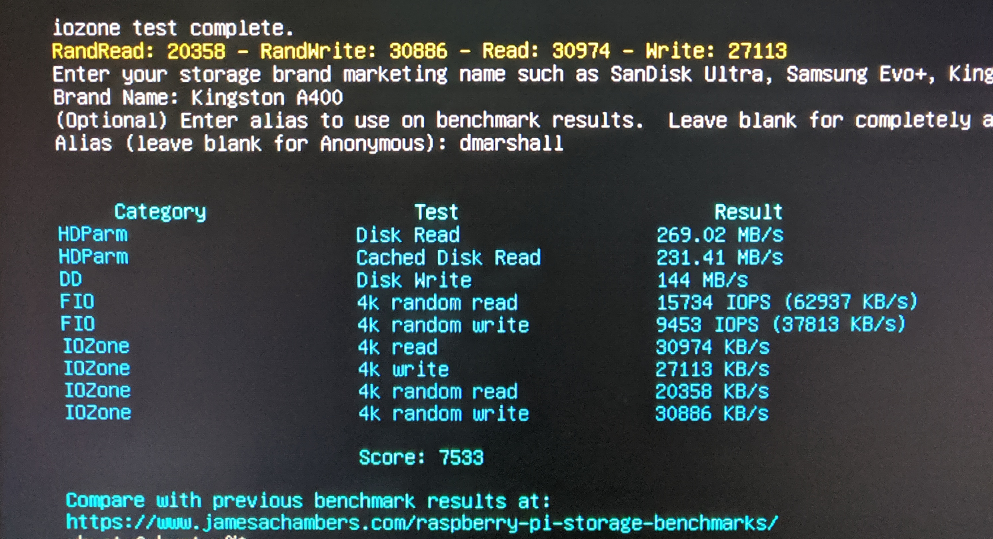

# I/O Benchmarks
Credit for this benchmark goes to James Chambers and this [excellent Pi-oriented benchmark script](https://jamesachambers.com/raspberry-pi-storage-benchmarks-2019-benchmarking-script/).

## Sandisk Ultra microSD 32GB
Available [here on Amazon](https://www.amazon.com/gp/product/B00CNYV942/ref=ppx_yo_dt_b_asin_title_o02_s01?ie=UTF8&psc=1) for about $14 for a 2-pack.

Scores a baseline 1,078 on the I/O benchmark:

We see read performance is adequate but the device performs poorly on random writes.
This is an excellent low-cost bootable microSD for experimental purposes.

## Sandisk Ultra Fit USB Flash Drive 128GB
Available [here on Amazon](https://www.amazon.com/SanDisk-128GB-Ultra-Flash-Drive/dp/B07855LJ99/ref=sr_1_1?crid=1QGB25GB7188T&keywords=sandisk+ultra+fit+128gb&qid=1565120868&s=gateway&sprefix=sandisk+ultra+fit%2Caps%2C175&sr=8-1) for about $18,

scores a better 1,393 on the I/O benchmark:

.

This is an interesting result. Read performance is a notch better than the microSD card, however random write performance is much worse.

## Kingston A400 2.5" SSD 120GB
This is device gives remarkably good I/O performance for a small price.
The 120GB drive is [available on Amazon](https://www.amazon.com/dp/B01N6JQS8C/ref=twister_B07Q8TL285?_encoding=UTF8&psc=1) . There's a 240GB version available for $10 more. You'll need a compatible USB 3 <-> SATA cable, and [this one from Startech](https://www.amazon.com/StarTech-com-SATA-USB-Cable-USB3S2SAT3CB/dp/B00HJZJI84/ref=sr_1_3?crid=9VR8VCHUUL00&keywords=startech+usb+sata+adapter&qid=1565121503&s=gateway&sprefix=startech+usb+sata+%2Celectronics%2C151&sr=8-3) works well for $10.

So this overall setup is $32 for 120GB or $42 for 240GB (adapter cable + SSD) and gives a credible 7,533 on the I/O benchmark:

.

This drive delivers more than 9K IOPS on random writes and 15K IOPS on random reads with 4K blocks.