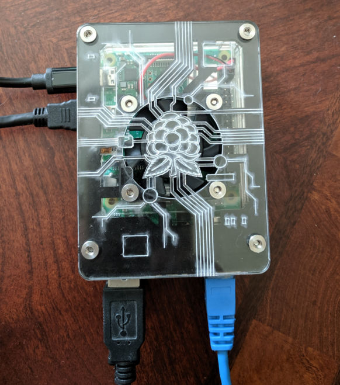

# Heatsinks
Installing heatsinks is not well documented. [This youtube video](https://www.youtube.com/watch?v=E-4GaAz7XNM) shows how to install the heatsinks provided from [Canakit](https://www.canakit.com/), a North-American Pi supplier.

# The Zebra Virtue Case
This case from [c4labs](https://www.c4labs.com/product/zebra-virtue-fan-case-raspberry-pi-3-b-color-options/) is an excellent layered case with a built-in interior fan which is acceptably loud (price $25).



With heatsinks installed and the case fan operating, a Pi 4 reports an operating temperature of around 38'C.

# Measuring Board Temperature
You may measure the on-board temperature for your Pi 4 by issuing the following command:
```
vcgencmd measure_temp
```
