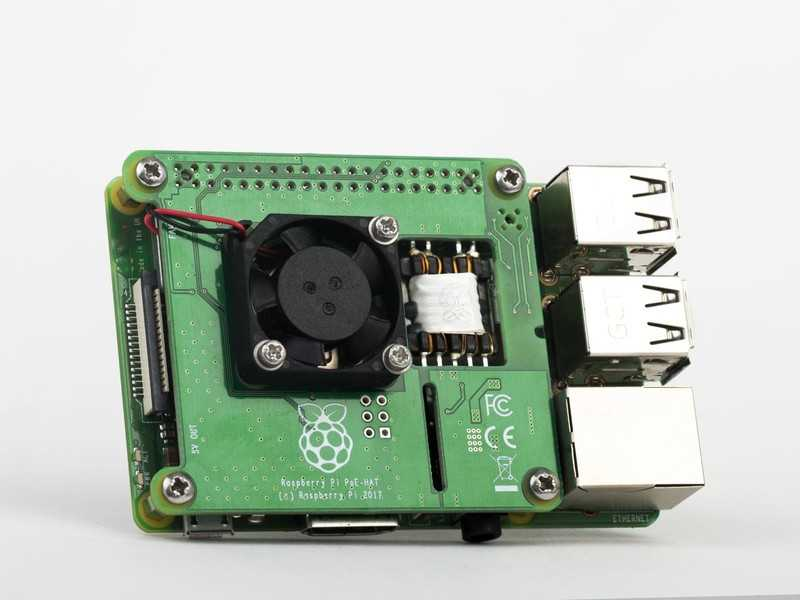

There are 3rd party PoE (power-over-ethernet) HATs available for Raspberry Pi 4, as well as an official PoE HAT from the foundation. Here we show results and conclusions from testing.

## Official PoE HAT ($20)
The official PoE HAT has an integrated fan and has a header which connects to (and masks) all 40 GPIO pins.

There are two issues with this HAT:

1. It's physically large and is incompatible with most cases (including all the cases I tried)
2. As the onboard header connects to all 40 GPIO pins it is not possible to connect additional case fans or other equipment

## PoETexas GAF-PiHAT ($26)
The [GAF-PiHAT](https://www.poetexas.com/products/gaf-pihat) is available from PoE Texas.

These are the PoE HATs of choice:

- they just work
- low-rise profile, fits in the C4Labs Cloudlet case
- no onboard fan, hence the low-rise profile

There are two 4-pin blocks on the HAT, one uses the PoE pins on the board, the other masks GPIO pins 1-6.
To attach the case fan from the cloudlet case requires a little connectivity, though a right-angle two pin
header works nicely.
